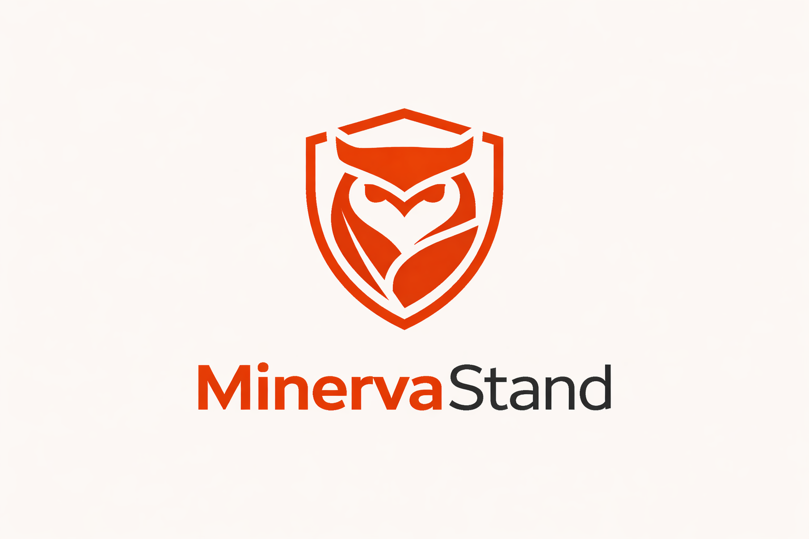

# Minerva Stand



Docker-first agent runtime for Minerva deployments.

## What It Is
**Minerva Stand** is Minerva's maintained agent runtime for production-style deployments.

It is built on a fork of `nanobot`, but this distribution is documented and operated as a Minerva project first. The focus here is simple Docker deployment, host-visible state, and easy day-to-day control over config, workspace files, audit logs, and guardrails.

For runtime compatibility today:
- the CLI inside the container is still `nanobot`
- the default runtime root is still `~/.nanobot`
- the Python package name is still `nanobot-ai`

## Fork Lineage
Minerva Stand keeps the lightweight Nanobot architecture and extends it with Minerva-focused operational controls, including:
- SQLite audit logging for agent runs and tool activity
- JSON-based guardrails before tool execution
- host-visible runtime state designed for easy inspection and recovery
- Docker-first deployment guidance

## Docker Deployment
Minerva Stand is intended to be deployed with a public container image.

Until the final registry path is fixed, use this placeholder:

```bash
ghcr.io/<org>/minerva-stand:latest
```

Replace `<org>` with your actual container namespace when publishing.

The recommended deployment model is:
- pull a public image
- mount one shared host folder to `/home/nanobot/.nanobot`
- keep config, workspace, audit DB, media, logs, and guardrails on the host
- run the gateway as the main long-lived container

## Host Folder Layout
Use one host-controlled runtime root:

```text
~/.nanobot/
├── config.json
├── guardrails.json
├── audit/
│   └── agent_audit.db
├── workspace/
│   ├── AGENTS.md
│   ├── HEARTBEAT.md
│   ├── memory/
│   └── sessions/
├── cron/
├── logs/
├── media/
├── bridge/
└── whatsapp-auth/
```

Recommended bind mount:

```bash
-v "$HOME/.nanobot:/home/nanobot/.nanobot"
```

This is the simplest setup because it makes all important files easy to manage from the host:
- edit `config.json` directly
- edit files in `workspace/`
- inspect `audit/agent_audit.db` with any SQLite tool
- edit `guardrails.json` directly
- keep state persistent across restarts and upgrades

## Quick Start
### 1. Pull the image
```bash
docker pull ghcr.io/<org>/minerva-stand:latest
```

### 2. Create the host runtime folder
```bash
mkdir -p "$HOME/.nanobot"/{workspace,audit,cron,logs,media}
```

### 3. Fix permissions if needed
The container runs as user `nanobot` with UID `1000`.

If your host folder is not writable by that UID, fix it first:

```bash
sudo chown -R 1000:1000 "$HOME/.nanobot"
```

### 4. Run first-time onboarding
```bash
docker run --rm -it \
  -v "$HOME/.nanobot:/home/nanobot/.nanobot" \
  ghcr.io/<org>/minerva-stand:latest \
  onboard
```

This creates the baseline config and workspace files under `~/.nanobot`.

### 5. Edit config on the host
Open:

```bash
$HOME/.nanobot/config.json
```

At minimum, configure your model and provider API key.

### 6. Start the gateway
```bash
docker run -d \
  --name minerva-stand-gateway \
  --restart unless-stopped \
  -v "$HOME/.nanobot:/home/nanobot/.nanobot" \
  -p 18790:18790 \
  --cap-drop=ALL \
  --cap-add=SYS_ADMIN \
  --security-opt apparmor=unconfined \
  --security-opt seccomp=unconfined \
  ghcr.io/<org>/minerva-stand:latest \
  gateway
```

## Configure Minerva Stand
The main config file is:

```bash
~/.nanobot/config.json
```

A minimal example:

```json
{
  "agents": {
    "defaults": {
      "workspace": "~/.nanobot/workspace",
      "model": "anthropic/claude-opus-4-5",
      "provider": "openrouter"
    }
  },
  "providers": {
    "openrouter": {
      "apiKey": "${OPENROUTER_API_KEY}"
    }
  },
  "audit": {
    "enabled": true,
    "dbPath": "~/.nanobot/audit/agent_audit.db",
    "retentionDays": 14,
    "cleanupIntervalMinutes": 60
  },
  "guardrails": {
    "enabled": true,
    "policyPath": "~/.nanobot/guardrails.json"
  },
  "tools": {
    "restrictToWorkspace": true,
    "exec": {
      "enable": true,
      "sandbox": "bwrap"
    }
  }
}
```

Guardrails policy file:

```bash
~/.nanobot/guardrails.json
```

Example policy template:

```bash
docs/guardrails.example.json
```

## Run The Gateway
The gateway is the main long-running service. It connects enabled channels, runs scheduled jobs, and executes agent workflows.

Start it with Docker:

```bash
docker run -d \
  --name minerva-stand-gateway \
  --restart unless-stopped \
  -v "$HOME/.nanobot:/home/nanobot/.nanobot" \
  -p 18790:18790 \
  --cap-drop=ALL \
  --cap-add=SYS_ADMIN \
  --security-opt apparmor=unconfined \
  --security-opt seccomp=unconfined \
  ghcr.io/<org>/minerva-stand:latest \
  gateway
```

View logs:

```bash
docker logs -f minerva-stand-gateway
```

Stop it:

```bash
docker stop minerva-stand-gateway
docker rm minerva-stand-gateway
```

## Test The Container
Run a few quick checks after setup.

### Check runtime status
```bash
docker run --rm \
  -v "$HOME/.nanobot:/home/nanobot/.nanobot" \
  ghcr.io/<org>/minerva-stand:latest \
  status
```

### Send one direct agent message
```bash
docker run --rm -it \
  -v "$HOME/.nanobot:/home/nanobot/.nanobot" \
  ghcr.io/<org>/minerva-stand:latest \
  agent -m "Summarize the workspace status"
```

### Inspect audit runs
```bash
docker run --rm \
  -v "$HOME/.nanobot:/home/nanobot/.nanobot" \
  ghcr.io/<org>/minerva-stand:latest \
  agent runs
```

### Inspect audit logs
```bash
docker run --rm \
  -v "$HOME/.nanobot:/home/nanobot/.nanobot" \
  ghcr.io/<org>/minerva-stand:latest \
  agent logs
```

## Common Operations
### Open an interactive CLI session
```bash
docker run --rm -it \
  -v "$HOME/.nanobot:/home/nanobot/.nanobot" \
  ghcr.io/<org>/minerva-stand:latest \
  agent
```

### Refresh onboarding defaults without losing current values
```bash
docker run --rm -it \
  -v "$HOME/.nanobot:/home/nanobot/.nanobot" \
  ghcr.io/<org>/minerva-stand:latest \
  onboard
```

### Check channel status
```bash
docker run --rm \
  -v "$HOME/.nanobot:/home/nanobot/.nanobot" \
  ghcr.io/<org>/minerva-stand:latest \
  channels status
```

### Rebuild the WhatsApp bridge if required
```bash
rm -rf "$HOME/.nanobot/bridge"
docker run --rm -it \
  -v "$HOME/.nanobot:/home/nanobot/.nanobot" \
  ghcr.io/<org>/minerva-stand:latest \
  channels login whatsapp
```

## Minerva Workbench (UI)
The image includes a Vite + Vue + DaisyUI workbench for chat, audit SQLite browsing, and workspace file editing. It is served on its own port by `nanobot serve-ui`; the API extensions live on `nanobot serve`.

**Compose:** `docker compose up -d` starts `stand-api` (8900) and `stand-ui` (5174). Set credentials on the API service:

| Variable | Purpose |
|----------|---------|
| `MINERVA_UI_USER` | Single-user login name |
| `MINERVA_UI_PASSWORD` | Password |
| `MINERVA_UI_SECRET` | Optional HMAC secret for session cookies (defaults to a derived value) |
| `MINERVA_UI_CORS_ORIGINS` | Comma-separated browser `Origin` values (optional; defaults include common dev ports on localhost / 127.0.0.1) |

**Browser ↔ API:** Open the UI and API using the **same hostname** (both `localhost` or both `127.0.0.1`). Mixing them breaks cookies. The production build resolves the API as `http(s)://<same-host-as-ui>:8900` unless you set `VITE_API_BASE_URL`. **`npm run dev`** proxies `/api`, `/health`, and `/v1` to `VITE_PROXY_TARGET` (default `http://127.0.0.1:8900`).

**Manual run:**

```bash
docker run -d --name minerva-ui -p 5174:5174 \
  -v "$HOME/.nanobot:/home/nanobot/.nanobot" \
  ghcr.io/<org>/minerva-stand:latest \
  serve-ui --host 0.0.0.0 --port 5174 --dist /app/ui/dist
```

**Local UI development:**

```bash
cd ui && npm install && npm run dev
```

Run `nanobot serve` on port 8900 in another terminal so `/api` proxies correctly.

## Docker Compose
For ongoing deployments, Compose is the recommended path.

The checked-in `docker-compose.yml` attaches an optional `env_file` (`.env`) to every service. Copy [.env.example](.env.example) to `.env`, set at least `OPENROUTER_API_KEY` (or another provider key that matches `NANOBOT_PROVIDER` / `NANOBOT_MODEL`), and set `MINERVA_UI_USER` / `MINERVA_UI_PASSWORD` if you use the API workbench. On start, the entrypoint runs [docker/bootstrap_config.py](docker/bootstrap_config.py), which updates `~/.nanobot/config.json` with `${VAR}` placeholders for any provider keys present in the environment, so nanobot can resolve secrets at runtime without storing raw keys in the mounted file.

```bash
cp .env.example .env
docker compose up -d --build
```

If your Compose version does not support `required: false` for `env_file`, create an empty `.env` or remove the `env_file` block and export variables in your shell.

The example below shows the intended published-image setup. The checked-in `docker-compose.yml` in this repo is still useful for local source builds, but production-style deployments should prefer `image: ghcr.io/<org>/minerva-stand:latest`.

```yaml
services:
  minerva-gateway:
    image: ghcr.io/<org>/minerva-stand:latest
    container_name: minerva-stand-gateway
    command: ["gateway"]
    restart: unless-stopped
    ports:
      - "18790:18790"
    volumes:
      - ${HOME}/.nanobot:/home/nanobot/.nanobot
    cap_drop:
      - ALL
    cap_add:
      - SYS_ADMIN
    security_opt:
      - apparmor=unconfined
      - seccomp=unconfined

  minerva-cli:
    image: ghcr.io/<org>/minerva-stand:latest
    profiles: ["cli"]
    command: ["status"]
    stdin_open: true
    tty: true
    volumes:
      - ${HOME}/.nanobot:/home/nanobot/.nanobot
    cap_drop:
      - ALL
    cap_add:
      - SYS_ADMIN
    security_opt:
      - apparmor=unconfined
      - seccomp=unconfined
```

Typical flow:

```bash
docker compose pull
docker compose run --rm -it minerva-cli onboard
docker compose up -d minerva-gateway
docker compose logs -f minerva-gateway
```

## Persistence And Files
With the recommended bind mount, the host is the source of truth for all important runtime state.

Important files and folders:
- `~/.nanobot/config.json`
- `~/.nanobot/workspace/`
- `~/.nanobot/workspace/sessions/`
- `~/.nanobot/audit/agent_audit.db`
- `~/.nanobot/guardrails.json`
- `~/.nanobot/cron/`
- `~/.nanobot/logs/`
- `~/.nanobot/media/`

If you want the workspace on a separate shared host path, add a second mount:

```bash
-v /path/to/shared-workspace:/home/nanobot/.nanobot/workspace
```

That is optional. The simplest supported setup is still one root mount for everything.

## Security Notes
Minerva Stand supports Bubblewrap sandboxing for shell execution. The current Docker runtime therefore needs:
- `--cap-drop=ALL`
- `--cap-add=SYS_ADMIN`
- `--security-opt apparmor=unconfined`
- `--security-opt seccomp=unconfined`

These settings match the current container model in this repository.

Also note:
- the container expects `/home/nanobot/.nanobot` to be writable
- the image runs as UID `1000`
- if you do not want Bubblewrap-based sandboxing, you can reduce privileges, but then `tools.exec.sandbox = "bwrap"` should not be used
- audit logs and guardrails are host-visible, so treat the host runtime folder as operational data

## Optional Services
### OpenAI-compatible API
If you also want the API service:

```bash
docker run -d \
  --name minerva-stand-api \
  --restart unless-stopped \
  -v "$HOME/.nanobot:/home/nanobot/.nanobot" \
  -p 127.0.0.1:8900:8900 \
  --cap-drop=ALL \
  --cap-add=SYS_ADMIN \
  --security-opt apparmor=unconfined \
  --security-opt seccomp=unconfined \
  ghcr.io/<org>/minerva-stand:latest \
  serve --host 0.0.0.0 -w /home/nanobot/.nanobot/api-workspace
```

### Interactive channel login
Some flows, especially WhatsApp login, require an interactive terminal session:

```bash
docker run --rm -it \
  -v "$HOME/.nanobot:/home/nanobot/.nanobot" \
  ghcr.io/<org>/minerva-stand:latest \
  channels login whatsapp
```

